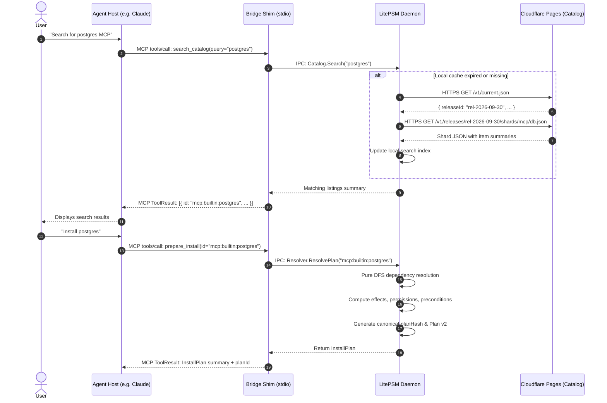
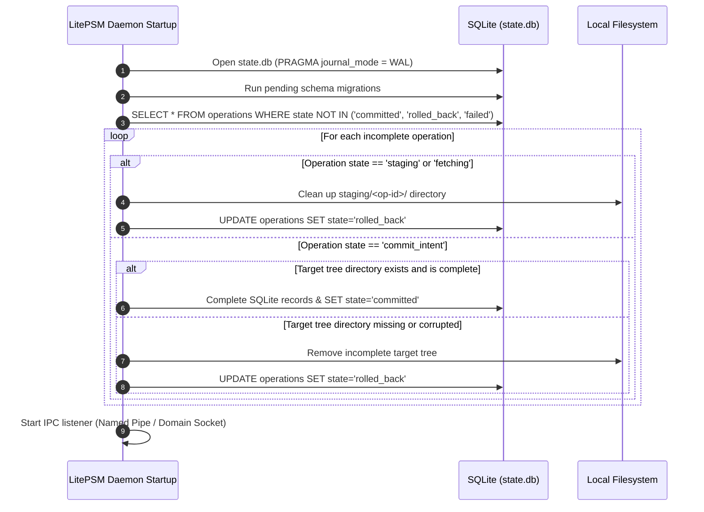

# High-Level Design (HLD)

## 1. System Topology & Architecture

LitePSM is bifurcated into two strictly isolated environments:
1.  **Public Discovery Plane (Cloud):** A static, read-only distribution architecture hosted on Cloudflare Pages, serving immutable catalog releases generated from a private source repository.
2.  **Local Control Plane (Workstation):** A client-side system consisting of thin, host-specific **Bridge Shims** communicating via secure local IPC with a persistent, single-writer **LitePSM Daemon**.

```text
                                 PUBLIC DISCOVERY PLANE
    ┌─────────────────────────────────────────────────────────────────────────┐
    │ Private GitHub Source Repository                                        │
    │ (Curation inputs · Source Adapters · Builder CI · Schemas · Web app)    │
    └────────────────────────────────────┬────────────────────────────────────┘
                                         │ CI validates, deduplicates & builds
                                         ▼
    ┌─────────────────────────────────────────────────────────────────────────┐
    │ Cloudflare Pages (Static CDN)                                           │
    │ /v1/current.json (Pointer)                                              │
    │ /v1/releases/<release-id>/ (Immutable metadata · Shards · Manifests)     │
    └────────────────────────────────────┬────────────────────────────────────┘
                                         │ HTTPS (Read-only, cached)
═════════════════════════════════════════╪══════════════════════════════════════════
                                 LOCAL CONTROL PLANE
                      (Isolated to User Workstation & OS User)

    ┌─────────────┐   ┌─────────────┐   ┌─────────────┐   ┌─────────────────┐
    │ Codex Host  │   │ Claude Code │   │  OpenCode   │   │  CLI / TUI App  │
    └──────┬──────┘   └──────┬──────┘   └──────┬──────┘   └────────┬────────┘
           │ stdio           │ stdio           │ stdio             │
           ▼                 ▼                 ▼                   │
    ┌─────────────┐   ┌─────────────┐   ┌─────────────┐            │
    │ Bridge Shim │   │ Bridge Shim │   │ Bridge Shim │            │
    └──────┬──────┘   └──────┬──────┘   └──────┬──────┘            │
           │                 │                 │                   │
           └─────────────────┼─────────────────┴───────────────────┘
                             │ Local Authenticated IPC
                             │ (Windows Named Pipe / Unix Domain Socket)
                             ▼
    ┌─────────────────────────────────────────────────────────────────────────┐
    │                           LitePSM Daemon                                │
    │ ┌─────────────────────────────────────────────────────────────────────┐ │
    │ │ Session Manager & IPC Dispatcher                                    │ │
    │ └──────────────┬──────────────────┬───────────────────┬───────────────┘ │
    │                ▼                  ▼                   ▼                 │
    │ ┌─────────────────────────┐ ┌───────────────┐ ┌───────────────────────┐ │
    │ │ SQLite State (WAL mode) │ │ Policy Engine │ │ OS Secret Broker      │ │
    │ │ (20 Relational Tables)  │ │ & Approvals   │ │ (WinCred/DPAPI/Keych) │ │
    │ └─────────────────────────┘ └───────────────┘ └───────────────────────┘ │
    │                │                  │                   │                 │
    │                ▼                  ▼                   ▼                 │
    │ ┌─────────────────────────┐ ┌─────────────────────────────────────────┐ │
    │ │ Content-Addressed Store │ │ Provider Supervisor                     │ │
    │ │ (trees/ & artifacts/)   │ │ (Process Groups / Windows Job Objects)  │ │
    │ └─────────────────────────┘ └────────────────────┬────────────────────┘ │
    └──────────────────────────────────────────────────┼──────────────────────┘
                                                       │
                                  ┌────────────────────┴────────────────────┐
                                  ▼                                         ▼
                      ┌───────────────────────┐                 ┌───────────────────────┐
                      │ Local stdio Provider  │                 │ Remote Streamable     │
                      │ (Node / Python / Bin) │                 │ HTTP Provider         │
                      └───────────────────────┘                 └───────────────────────┘
```

---

## 2. Process Separation: Bridge Shim vs. Local Daemon

To guarantee data integrity and prevent concurrency hazards across multiple simultaneous agent hosts, LitePSM strictly enforces a single-writer architecture:

### 2.1 The Bridge Shim (Thin Client)
*   **Role:** Stateless MCP stdio protocol translator.
*   **Execution:** Spawned directly by the host agent (e.g., Codex or Claude Code) as a subprocess.
*   **Responsibilities:**
    1.  Speaks standard MCP JSON-RPC over `stdin`/`stdout`.
    2.  Identifies host identity (`--host claude-code`) and session attributes.
    3.  Establishes or reuses a local IPC connection to the LitePSM Daemon (launching the daemon in the background if not running).
    4.  Translates MCP tool calls (`search_catalog`, `invoke_capability`) to internal IPC RPCs.
    5.  Exits cleanly when the host agent terminates stdio.
*   **Prohibitions:** The Bridge Shim **never** opens SQLite directly, never writes to configuration files, and never launches downstream provider child processes.

### 2.2 The LitePSM Daemon (Single Writer & Supervisor)
*   **Role:** Authoritative local control plane and state owner.
*   **Execution:** Runs as a background service per operating system user account.
*   **Responsibilities:**
    1.  **Sole SQLite Writer:** Exclusively holds SQLite write transactions in WAL mode, ensuring atomic commits and eliminating file-lock collisions.
    2.  **Process Supervisor:** Launches, monitors, and terminates downstream MCP provider processes using Windows Job Objects or Unix process groups to prevent zombie processes.
    3.  **Policy & Approval Authority:** Evaluates tool invocation permissions and validates plan hashes against user approvals.
    4.  **Secret Store Broker:** Interacts with the platform's credential vault (Windows Credential Manager, macOS Keychain, Linux Secret Service).
    5.  **Crash Recovery:** Executes the operation journal recovery algorithm on startup to resolve interrupted filesystem transitions.

---

## 3. Concurrency & Transaction Model

*   **Read Concurrency:** SQLite in Write-Ahead Logging (WAL) mode enables concurrent, non-blocking reads. The Bridge Shims can query catalog caches, installed capability lists, and schema metadata simultaneously without lock contention.
*   **Write Serialization:** All mutating operations (installing packages, modifying host configuration, granting capability approvals, launching providers) are serialized through the daemon's internal event queue.
*   **Atomic Two-Phase Commits:** Filesystem mutations (extracting trees) and database state updates are synchronized via a two-phase journal (`commit_intent` $\rightarrow$ atomic directory rename $\rightarrow$ SQLite transaction commit $\rightarrow$ `committed`).

---

## 4. Architectural Sequence Workflows

### 4.1 Catalog Search & Plan Resolution



### 4.2 Plan Approval & Transactional Installation

```mermaid
sequenceDiagram
    autonumber
    actor User
    participant Host as Agent Host
    participant Shim as Bridge Shim
    participant Daemon as LitePSM Daemon
    participant Store as Local CAS Store (trees/)
    participant DB as SQLite (state.db)

    alt Host supports reliable form elicitation
        Host->>User: Prompts with Plan details & planHash
        User->>Host: Approves installation
        Host->>Shim: MCP tools/call: request_install(planId, approvalToken)
        Shim->>Daemon: IPC: Install.Execute(planId, approvalToken)
    else Host does not support elicitation (CLI fallback)
        Shim-->>Host: Returns CLI command: "litepsm install --plan-id ..."
        User->>Daemon: Terminal command: litepsm install --plan-id ...
    end

    Daemon->>Daemon: Verify planHash matches approval & plan not expired
    Daemon->>DB: INSERT INTO operations (state='staging')
    Daemon->>Store: Download artifact into staging/<op-id>/
    Daemon->>Store: Verify SHA-256 digest & inspect archive limits
    Daemon->>Store: Extract to staging tree (no symlinks, no scripts)
    Daemon->>DB: UPDATE operations SET state='commit_intent'
    Daemon->>Store: Atomic directory rename staging/ -> trees/<tree-digest>/
    Daemon->>DB: BEGIN TRANSACTION; INSERT INTO installs; UPDATE operations SET state='committed'; COMMIT;
    Daemon-->>User: Installation succeeded & verified
```

### 4.3 Policy-Checked Capability Invocation & Schema Drift


### 4.4 Daemon Startup & Crash Recovery



---

## 5. Trust Boundaries & Security Invariants

1.  **Public Metadata is Untrusted:** Upstream package listings and catalog files are untrusted external inputs. The builder and client parse them with bounded memory, validate them against strict JSON schemas, and never execute scripts contained within them.
2.  **No Dynamic Code Execution during Installation:** Installing a skill or MCP server never triggers post-install scripts (e.g., `npm postinstall`, shell hooks). Files are unpacked passively into the Content-Addressed Store.
3.  **Local Daemon Security Descriptor:** The daemon IPC listener rejects connections from any other user account on the operating system:
    *   **Windows:** Named Pipe secured with a DACL granting access strictly to the current user's Security Identifier (`SDDL: D:(A;;GA;;;OW)`).
    *   **Unix / macOS:** Domain socket created in a directory with permissions `0700`, with socket file permissions `0600`.
4.  **Credential Locality:** The public catalog API, discovery plane, and build infrastructure never receive or store user credentials. Downstream API keys and OAuth tokens are brokered strictly on-device through operating system secret stores.
