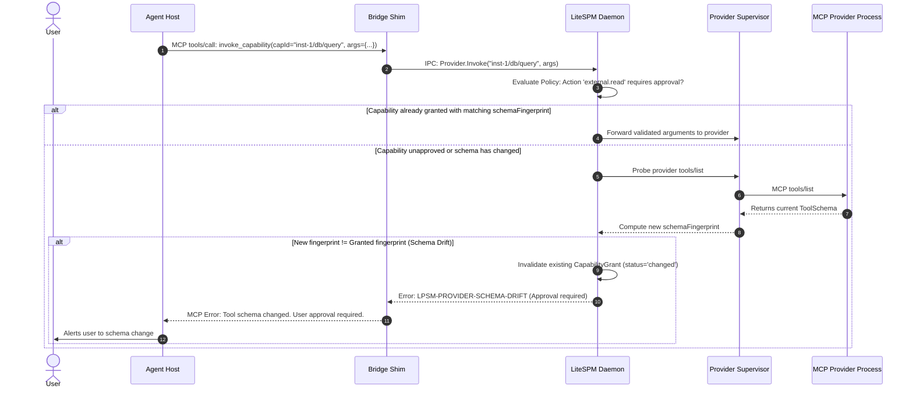
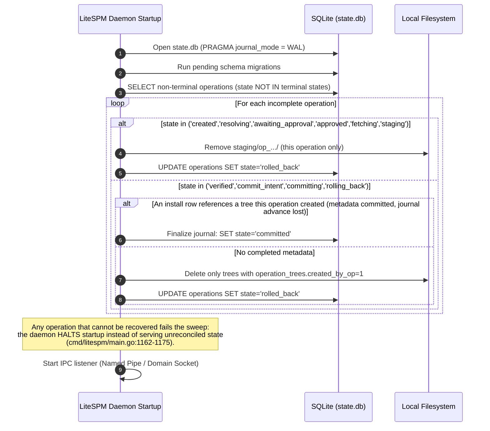

# High-Level Design (HLD)

## 1. System Topology & Architecture

LiteSPM is bifurcated into two strictly isolated environments:
1.  **Public Discovery Plane (Cloud):** A static, read-only distribution. The deployed catalog data is produced by `scripts/build_full_catalog.py` (the Python builder is the deployed producer; CI does not run it — [STATUS.md](../STATUS.md) §6) and served from a static origin: `/v1/current.json` **and** the immutable `/v1/releases/<id>/…` trees are live today (probe 2026-10-05: all four files `200`, byte-identical to the committed release).
2.  **Local Control Plane (Workstation):** A client-side system consisting of thin, host-specific **Bridge Shims** communicating via secure local IPC with a persistent, single-writer **LiteSPM Daemon**.

```text
                                 PUBLIC DISCOVERY PLANE
    ┌─────────────────────────────────────────────────────────────────────────┐
    │ Source Repository (contributor checkout)                               │
    │ (Curation inputs · Source Adapters · Python catalog builder · Schemas · Web app) │
    └────────────────────────────────────┬────────────────────────────────────┘
                                         │ Builder run (script; CI does not run it)
                                         ▼
    ┌─────────────────────────────────────────────────────────────────────────┐
    │ Static Origin (Cloudflare Pages / Workers)                              │
    │ /v1/current.json (Pointer — live, HTTP 200)                             │
    │ /v1/releases/<id>/{listings,versions,manifest}.json (compiler layout;   │
    │   published live 2026-10-05 — rel-2026-10-05-01)                       │
    └────────────────────────────────────┬────────────────────────────────────┘
                                         │ HTTPS (Read-only, cached)
═════════════════════════════════════════╪══════════════════════════════════════════
                                 LOCAL CONTROL PLANE
                      (Isolated to User Workstation & OS User)

    ┌─────────────┐   ┌─────────────┐   ┌─────────────┐   ┌─────────────────┐
    │ Codex Host  │   │ Claude Code │   │  OpenCode   │   │  CLI / TUI App  │
    └──────┬──────┘   └──────┬──────┘   └──────┬──────┘   └────────┬────────┘
           │ stdio           │ stdio           │ stdio             │
           ▼                 ▼                 ▼                   │
    ┌─────────────┐   ┌─────────────┐   ┌─────────────┐            │
    │ Bridge Shim │   │ Bridge Shim │   │ Bridge Shim │            │
    └──────┬──────┘   └──────┬──────┘   └──────┬──────┘            │
           │                 │                 │                   │
           └─────────────────┼─────────────────┴───────────────────┘
                             │ Local IPC (OS-level ACLs:
                             │ Windows Named Pipe DACL / Unix Domain Socket 0600)
                             ▼
    ┌─────────────────────────────────────────────────────────────────────────┐
    │                           LiteSPM Daemon                                │
    │ ┌─────────────────────────────────────────────────────────────────────┐ │
    │ │ Session Manager & IPC Dispatcher                                    │ │
    │ └──────────────┬──────────────────┬───────────────────┬───────────────┘ │
    │                ▼                  ▼                   ▼                 │
    │ ┌─────────────────────────┐ ┌───────────────┐ ┌───────────────────────┐ │
    │ │ SQLite State (WAL mode) │ │ Policy Engine │ │ OS Secret Broker      │ │
    │ │ (22 Relational Tables)  │ │ & Approvals   │ │ (DPAPI/Keychain/DBus) │ │
    │ └─────────────────────────┘ └───────────────┘ └───────────────────────┘ │
    │                │                  │                   │                 │
    │                ▼                  ▼                   ▼                 │
    │ ┌─────────────────────────┐ ┌─────────────────────────────────────────┐ │
    │ │ Content-Addressed Store │ │ Provider Supervisor                     │ │
    │ │ (cas/trees/sha256/<hex>)│ │ (Process Groups / Windows Job Objects)  │ │
    │ └─────────────────────────┘ └────────────────────┬────────────────────┘ │
    └──────────────────────────────────────────────────┼──────────────────────┘
                                                       │
                                  ┌────────────────────┴────────────────────┐
                                  ▼                                         ▼
                      ┌───────────────────────┐                 ┌───────────────────────┐
                      │ Local stdio Provider  │                 │ Remote Streamable     │
                      │ (Node / Python / Bin) │                 │ HTTP Provider         │
                      └───────────────────────┘                 └───────────────────────┘
```

> **Discovery-plane status.** The compiler (`internal/catalogbuild/compiler.go:101,117,150,172`) and the client (`internal/catalog/client.go:73,124,160`) agree on the `/v1/current.json` + `/v1/releases/<id>/{listings,versions,manifest}.json` layout, pinned by `TestReleasePathContractPinsDocumentedLayout` (`internal/catalog/catalog_test.go:217`). The live origin serves the **whole tree** (probe 2026-10-05: `/v1/current.json` and `/v1/releases/rel-2026-10-05-01/{manifest,listings,versions}.json` all 200, byte-identical to the committed release), so `litespm catalog sync` is `SHIPPED` ([STATUS.md](../STATUS.md) §2). The compiler emits exactly four files — there are no shards.

---

## 2. Process Separation: Bridge Shim vs. Local Daemon

To guarantee data integrity and prevent concurrency hazards across multiple simultaneous agent hosts, LiteSPM strictly enforces a single-writer architecture:

### 2.1 The Bridge Shim (Thin Client)
*   **Role:** Stateless MCP stdio protocol translator.
*   **Execution:** Spawned directly by the host agent (e.g., Codex or Claude Code) as a subprocess.
*   **Responsibilities:**
    1.  Speaks standard MCP JSON-RPC over `stdin`/`stdout`.
    2.  Identifies host identity (`--host claude-code`) and session attributes.
    3.  Dials the local IPC endpoint of the LiteSPM Daemon. **It never launches the daemon**: if the dial fails, `litespm bridge` runs standalone with no capabilities and says so on stderr, telling the user to start `litespm daemon serve` (`cmd/litespm/main.go:344-348`).
    4.  Translates MCP tool calls to internal IPC RPCs (`search_catalog` → `catalog.search`, `prepare_install` → `resolver.prepare_plan`, …). `search_capabilities`, `describe_capability` and `invoke_capability` resolve over discovered capability rows through `internal/discover`; only `get_invocation` and `cancel_invocation` map to handlers that return explicit `-32601` today, because the asynchronous registry they need is `ARCH/34` (`DESIGNED`) ([STATUS.md](../STATUS.md) §4).
    5.  Exits cleanly when the host agent terminates stdio.
*   **Prohibitions:** The Bridge Shim **never** opens SQLite directly, never writes to configuration files, and never launches downstream provider child processes.

### 2.2 The LiteSPM Daemon (Single Writer & Supervisor)
*   **Role:** Authoritative local control plane and state owner.
*   **Execution:** Runs as a background service per operating system user account.
*   **Responsibilities:**
    1.  **Authoritative Writer:** Holds SQLite write transactions in WAL mode for every daemon-mediated operation and excludes competing daemon instances with `DATA_ROOT/daemon.lock`. (Direct-write CLI commands are the one exception — see §3.)
    2.  **Process Supervisor:** Launches, monitors, and terminates downstream MCP provider processes using Windows Job Objects or Unix process groups to prevent zombie processes.
    3.  **Policy & Approval Authority:** Evaluates tool invocation permissions and validates plan hashes against user approvals.
    4.  **Secret Store Broker:** Interacts with the platform's credential vault (Windows Credential Manager, macOS Keychain, Linux Secret Service).
    5.  **Crash Recovery:** Executes the operation journal recovery algorithm on startup to resolve interrupted filesystem transitions.

---

## 3. Concurrency & Transaction Model

*   **Read Concurrency:** SQLite in Write-Ahead Logging (WAL) mode enables concurrent, non-blocking reads. The Bridge Shims can query catalog caches, installed capability lists, and schema metadata simultaneously without lock contention.
*   **Write Serialization:** Long-lived writes flow through the daemon, which excludes concurrent daemon instances with an exclusive `DATA_ROOT/daemon.lock` (pid-stamped, `cmd/litespm/main.go:1142,1919-1934` — there is no separate pid file). Short-lived CLI commands (`install`, `skills …`) open the state DB directly, so safety comes from SQLite WAL transactions plus the `sync.RWMutex` in `internal/state.DB` (`internal/state/db.go:22`). Bridge Shims never open SQLite (§2.1).
*   **Atomic Two-Phase Commits:** Filesystem mutations and database state updates are synchronized by the operation journal: `created → resolving → [awaiting_approval → approved] → fetching → staging → commit_intent` → atomic placement into `cas/trees/sha256/<hex>` → digest re-verification (`verified`) → one SQLite transaction (`committing → committed`); any failure walks `rolling_back → rolled_back` (`internal/install/engine.go:244-435`, `internal/state/operations.go:280-343`).

---

## 4. Architectural Sequence Workflows

### 4.1 Catalog Search & Plan Resolution

```mermaid
sequenceDiagram
    autonumber
    actor User
    participant Host as Agent Host (e.g. Claude)
    participant Shim as Bridge Shim (stdio)
    participant Daemon as LiteSPM Daemon
    participant Origin as Static Origin (Catalog)

    User->>Host: "Search for postgres MCP"
    Host->>Shim: MCP tools/call: search_catalog(query="postgres")
    Shim->>Daemon: IPC: catalog.search(query)
    Note over Daemon: Search reads the in-memory index only — no network I/O.<br/>The index is loaded from the local cache (DATA_ROOT/v1/current.json +<br/>DATA_ROOT/v1/releases/&lt;id&gt;/listings.json) when the client is created.
    alt Local cache populated
        Daemon-->>Shim: Matching listings summary
    else Local cache empty (no successful sync yet)
        Daemon-->>Shim: count: 0 (hint: run `litespm catalog sync`)
    end
    Shim-->>Host: MCP ToolResult: [{ id: "mcp:builtin:mcp-registry:postgres", ... }]
    Host-->>User: Displays search results

    Note over Daemon,Origin: The only network path is the separate `litespm catalog sync`: GET /v1/current.json<br/>then GET /v1/releases/&lt;id&gt;/manifest.json + listings.json<br/>(both 200 at the live origin — verified 2026-10-05; STATUS §2).

    User->>Host: "Install postgres"
    Host->>Shim: MCP tools/call: prepare_install(id="mcp:builtin:mcp-registry:postgres")
    Shim->>Daemon: IPC: resolver.prepare_plan(...)
    Daemon->>Daemon: Pure DFS dependency resolution + semver constraint intersection
    Daemon->>Daemon: Compute effects, permissions, preconditions
    Daemon->>Daemon: Generate canonical planHash; persist plan (db.SavePlan)
    Daemon-->>Shim: Return InstallPlan + planId
    Shim-->>Host: MCP ToolResult: InstallPlan summary + planId
```

> **Status of §4.1.** `search_catalog` → `catalog.search` (local index) and `prepare_install` → `resolver.prepare_plan` (persisted plan + `planHash`) are `WIRED`. `litespm catalog sync` is `SHIPPED` — it succeeds against the live origin (verified 2026-10-05). No shard/`index.json` path exists — shards are `DESIGNED` ([STATUS.md](../STATUS.md) §2; `ARCH/18`).

### 4.2 Plan Approval & Transactional Installation

```mermaid
sequenceDiagram
    autonumber
    actor User
    participant Host as Agent Host
    participant Shim as Bridge Shim
    participant Daemon as LiteSPM Daemon
    participant Store as Local CAS (cas/trees/)
    participant DB as SQLite (state.db)

    alt Host supports reliable form elicitation
        Host->>User: Prompts with Plan details & planHash
        User->>Host: Approves installation
        Host->>Shim: MCP tools/call: request_install(planId, approvalToken)
        Shim->>Daemon: IPC: install.execute(planId, approvalToken)
        Note over Daemon: skills install through the skills ledger, MCP servers are registered<br/>in each target host's config (plan + approval required);<br/>only plugins fail closed (LPSM-ARTIFACT-UNAVAILABLE —<br/>no artifact source; internal/install/engine.go:204).
        Daemon-->>Shim: ERROR: LPSM-ARTIFACT-UNAVAILABLE (plugins only)
        Shim-->>Host: MCP tool error — plugin install cannot complete (STATUS §3)
    else Host does not support elicitation (human CLI path)
        User->>User: litespm install "listing-id" --version "ver" --scope user or project
        Note over User: The CLI takes no --plan-id: it records its own plan and approval.<br/>It routes by kind: skills install real files, MCP servers register in host configs;<br/>plugins fail closed.
    end

    Note over Daemon,Store: The steps below are the engine's real executed path; today nothing<br/>supplies an archive artifact source, so a plugin install (a different path) cannot complete.

    Daemon->>Daemon: Verify planHash & expiry when a planId was bound (engine.loadPlan)
    Daemon->>DB: INSERT INTO operations (state='created')
    Daemon->>DB: state='resolving' [-> 'awaiting_approval' -> 'approved']
    Daemon->>Store: Fetch archive into staging/op_.../source.archive (bounded spool)
    Daemon->>Store: Verify declared SHA-256 digest & archive limits
    Daemon->>Store: Extract to staging/op_.../extracted (no symlinks, no scripts)
    Daemon->>DB: state='commit_intent'
    Daemon->>Store: Atomic placement staging/extracted -> cas/trees/sha256/…
    Daemon->>Store: Recompute canonical tree digest (state='verified')
    Daemon->>DB: BEGIN TRANSACTION; INSERT INTO installs; state='committed'; COMMIT;
    Daemon-->>User: Installation succeeded & verified
```

### 4.3 Policy-Checked Capability Invocation & Schema Drift



### 4.4 Daemon Startup & Crash Recovery



> **Status of §4.3–§4.4.** Recovery is implemented and test-covered (`internal/state/operations.go:243-343`; `TESTED` per [STATUS.md](../STATUS.md) §1). The §4.3 invocation flow is **partly** real: `provider.invoke` and the Bridge tool `invoke_capability` now resolve synchronously through `internal/discover` (probe → policy → schema-fingerprint re-check → call), but `invocation.get` / `invocation.cancel` and their Bridge counterparts still return explicit `-32601` — there is no asynchronous invocation registry (`cmd/litespm/main.go:2216,2225`; [STATUS.md](../STATUS.md) §4). The asynchronous, receipted §4.3 is target design specified in `ARCH/34` (`DESIGNED`).

---

## 5. Trust Boundaries & Security Invariants

1.  **Public Metadata is Untrusted:** Upstream package listings and catalog files are untrusted external inputs. They are decoded with strict typed JSON and never executed; IPC messages are capped at 16 MiB (`internal/ipc/protocol.go:26`), archives at `ExtractionLimits` (ARCH/17 §3). Note what does **not** exist today: no JSON-Schema validation layer runs on catalog files (ARCH/23 schemas are documents), and catalog HTTP reads are bounded only by the 30 s client timeout (`internal/catalog/client.go:40`), not by a body-size cap.
2.  **No Dynamic Code Execution during Installation:** Installing a skill or MCP server never triggers post-install scripts (e.g., `npm postinstall`, shell hooks). Files are unpacked passively into the Content-Addressed Store.
3.  **Local Daemon Security Descriptor:** The daemon IPC listener rejects connections from any other user account on the operating system:
    *   **Windows:** Named Pipe secured with a DACL granting access strictly to the current user's Security Identifier (`SDDL: D:(A;;GA;;;OW)`).
    *   **Unix / macOS:** Domain socket created in a directory with permissions `0700`, with socket file permissions `0600`.
4.  **Credential Locality:** The public catalog API, discovery plane, and build infrastructure never receive or store user credentials. Downstream API keys and OAuth tokens are brokered strictly on-device through operating system secret stores.

---

## 6. Control-Plane Extensions (`DESIGNED`)

[STATUS.md](../STATUS.md) decomposes the product into five working planes — **control**, **catalog & source**, **install**, **provider & invocation runtime**, and **governance & evidence** (plus interfaces & packaging) — and `ARCH/31` proposal #1 keeps that 5-plane decomposition. The next-generation control-plane capabilities live in `ARCH/32`–`ARCH/38`; every one of them is `DESIGNED` and none has code:

| Plane (STATUS.md) | Extension | Design record | State |
|---|---|---|---|
| Install + governance | Project manifest (`litespm.yml`) + lockfile (`litespm.lock`), frozen resolve, SBOM/verify verbs, interop import/export, canonical identity/alias graph | `ARCH/32` | `DESIGNED` |
| Install + governance | Deployment mutation ledger, three-way reconciliation, ownership-aware uninstall/update | `ARCH/33` | `DESIGNED` |
| Provider & invocation runtime | Capability registry, real `provider.invoke` / `invocation.get` / `invocation.cancel`, invocation engine, tamper-evident receipts | `ARCH/34` | `DESIGNED` |
| Provider & invocation runtime (+ governance leases) | Runtime profiles with OCI distribution; time/scope-bounded capability leases | `ARCH/35` | `DESIGNED` |
| Governance & evidence | Tighten-only policy hierarchy + `policy explain`, `audit --ci`/SARIF, advisories/quarantine, TUF-style signed catalog, SBOM/Sigstore/SLSA, air-gapped bundles | `ARCH/36` | `DESIGNED` |
| Interfaces & packaging | TUI, local dashboard, shell completion, `why` | `ARCH/37` | `DESIGNED` |
| Control + interfaces | Cross-agent porting (`litespm copy` via a canonical IR), `list`/`inventory`, the `help` system, orient commands (`status`/`diff`/`why`/`outdated`) | `ARCH/38` | `DESIGNED` |
| Control + interfaces | Web product redesign: three visual densities (DISCOVER/EVALUATE/OPERATE), design-system tokens, landing page, Agent Atlas, compare, palette | `ARCH/25` §5–§8 | `DESIGNED` |

Today's control plane — the 12-tool bridge shim, the single-writer daemon, policy/skills gates, `doctor`, `self-update` (SHA-256 fail-closed plus keyless signature verification when a release publishes a bundle), host MCP-entry merge, and local catalog search — is `WIRED`; see [STATUS.md](../STATUS.md) §1 for the per-subsystem evidence.
